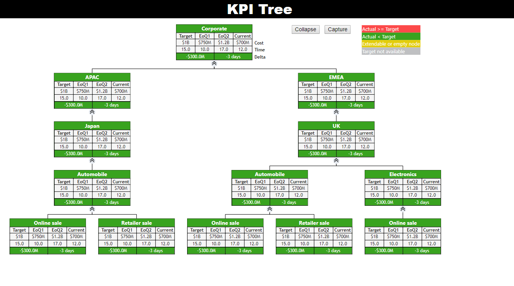
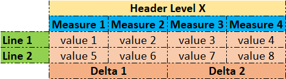
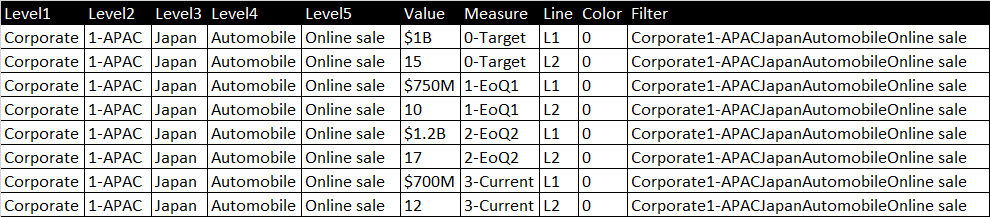

# KPI Tree
## Introduction
This custom visual project was built to visualize the tree-structured information commonly found in organizational reports. Its special characteristics include:

* Collapsible nodes
* Comprehensive data grid in each node
* KPI color coding
* High-resolution printing

    

## Node structure
The core principle of this visual is the coordinating system, which binds and translates data from the table to the grid on each node.

    

* Header Level X: the header of the node at level X from 1 to 5.
* Measure: the measurement extracted from data, for example, Year to Date or End of Quarter.
* Line: the row of calculated values on the same unit over four measures, for example, USD or time (days).
* Value: the actual calculated values.
* Delta 1 = Measure 4 - Measure 1 at Line 1
* Delta 2 = Measure 4 - Measure 1 at Line 2

## Input data structure
Based on the formation above, data needs to be flattened into a table structure which satisfies that:

* The Header Level X must be put into column "LevelX".
* The "Measure" column must have four distinct measures, and to rank them correctly, they must be associated with prefixes starting from 0- to 3-.
* The "Line" column must have two distinct items as L1 and L2.
* The "Color" column contains the color codes, 0 ~ green, 1 ~ red, and 2 ~ gray.
* The "Filter" column is a combination of strings in columns "LevelX", this column will help to apply a filter when the user clicks on any node.

For example, to show the level 5 node, "Online sale", the user has to declare all the parents' nodes and create eight rows of data to contain the combination of measures and lines.

    

## Dependencies
* [`js-base64`](https://github.com/dankogai/js-base64): Base64 transcoder library used for translating 
SVG object into Base64 string. This library is selected because it can solve the problem of the transcoding currency symbol.
* [`file-saver`](https://github.com/Infinidat/file-saver): save the large file (blob object) via the network.

## Important files
* `visual.ts`: the main source code designed for the custom visual.
* `settings.ts`: define a default value for custom visual components (legend, annotation, etc.)
* `visual.less`: define the style of the visual.
* `tsconfig.json`: typescript library reference.
* `pbiviz.json`: javascript library reference.
* `capabilities.json`: configure Category, Color, and Data Value.
* `package.json`: dependencies version (auto-generated when executing the npm installation).

## How to start the project
* Following the instruction [HERE](https://docs.microsoft.com/en-us/power-bi/developer/custom-visual-develop-tutorial) from Microsoft to set up the custom visual development environment.
* Remember to install pbiviz version 2.6: `npm i -g powerbi-visuals-tools@2.6`
* Start debugging: `pbiviz start`
* Packge project: `pbiviz package`, the output file will be placed on `./dist/` of the project folder.